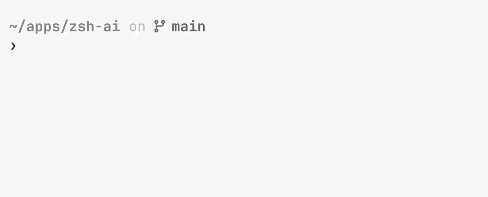

<p align="center">
  
</p>

<h1 align="center">zsh-ai</h1>

Type `# ` and describe a command. Press Enter to get it at your prompt.

```console
$ # find files larger than 100mb changed this week
$ find . -type f -size +100M -mtime -7
```

Read it, edit it if needed, then press Enter again to run it.



You can also ask directly:

```zsh
zsh-ai "show what is using port 3000"
```

Your request includes the directory path, nearby filenames, project type, git
branch/status, and OS. Choose a hosted provider or run a local model with Ollama.

## Install

Needs zsh 5.0+, `curl`, and `perl`. `jq` is optional.

```zsh
brew install matheusml/zsh-ai/zsh-ai
```

Add this to `~/.zshrc` (keep your key out of public dotfiles):

```zsh
export ANTHROPIC_API_KEY="your-key-here"
source "$(brew --prefix)/share/zsh-ai/zsh-ai.plugin.zsh"
```

Run `source ~/.zshrc`, then try `# show current date`.

See the [install guide](INSTALL.md) for Oh My Zsh, Antigen, manual installs,
[other providers](INSTALL.md#providers), and local models.

## Make it yours

Add command preferences before the plugin loads in `~/.zshrc`:

```zsh
export ZSH_AI_PROMPT_EXTEND="Prefer rg over grep and fd over find."
```

You can also [change the comment trigger or turn it off](INSTALL.md#inline-trigger).

[Troubleshooting](TROUBLESHOOTING.md) · [Contributing](CONTRIBUTING.md) · [MIT license](LICENSE)
